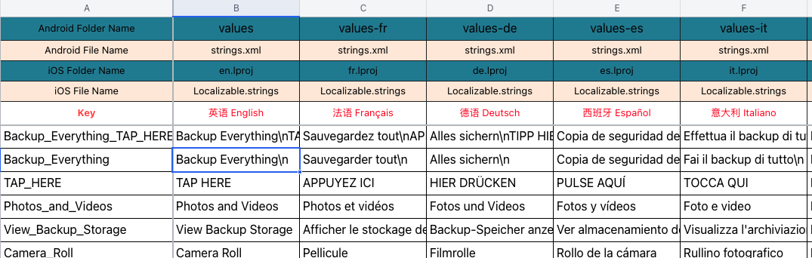

# LanguageGenerate

#### 介绍
    CSV_To_iOS_And_Android_Localizable:文件夹中的的脚本适用于将Excel导出的CSV文件生成iOS和Android使用的多语言文件。在Excel的模版需要与以下图片一致(表格的颜色没有影响主要是格式，1~2行用于生成Android的文件夹以及文件，3~4行用于生成iOS的文件夹以及文件。5行用于说明的属于一个占位行):

    iOS_Localizable_To_XML:文件夹的脚本适用于将iOS中的多语言文件转为Excel能够打开的XML格式的文件。

    注意:
        1.脚本的执行会将字符&转为^^,\n转为//n（其实并没有什么影响，转换完成后会转回原本的字符）。
        2.脚本双击出现未知运行需要在“系统设置”->"隐私与安全性"中允许当前的脚本执行。

#### 安装插件
	
    #使用iOS多语言文件转XML文件时需要下载xmllint 的插件(iOS使用 brew xmllint 安装下载) 。CSV脚本不依赖任何插件！

#### 使用说明
	1.CSV_To_iOS_And_Android_Localizable的脚本双击直接执行，如果已经将导出的文件放置在文件夹中并且设置文件的名称为file.csv执行时可以输入Y回车执行。否者使用N的操作将需要执行的csv文件地址输入后确认。
	2.iOS_Localizable_To_XML执行后会提示输入Y/N，如果在“iOS_Localizable_To_XML”文件夹内创建了source文件夹并且将iOS多国语言的文件夹放入其中的情况可以使用Y的模式，否则使用N的模式需要输入目标多国语言的目录的上一级目录地址。
	

